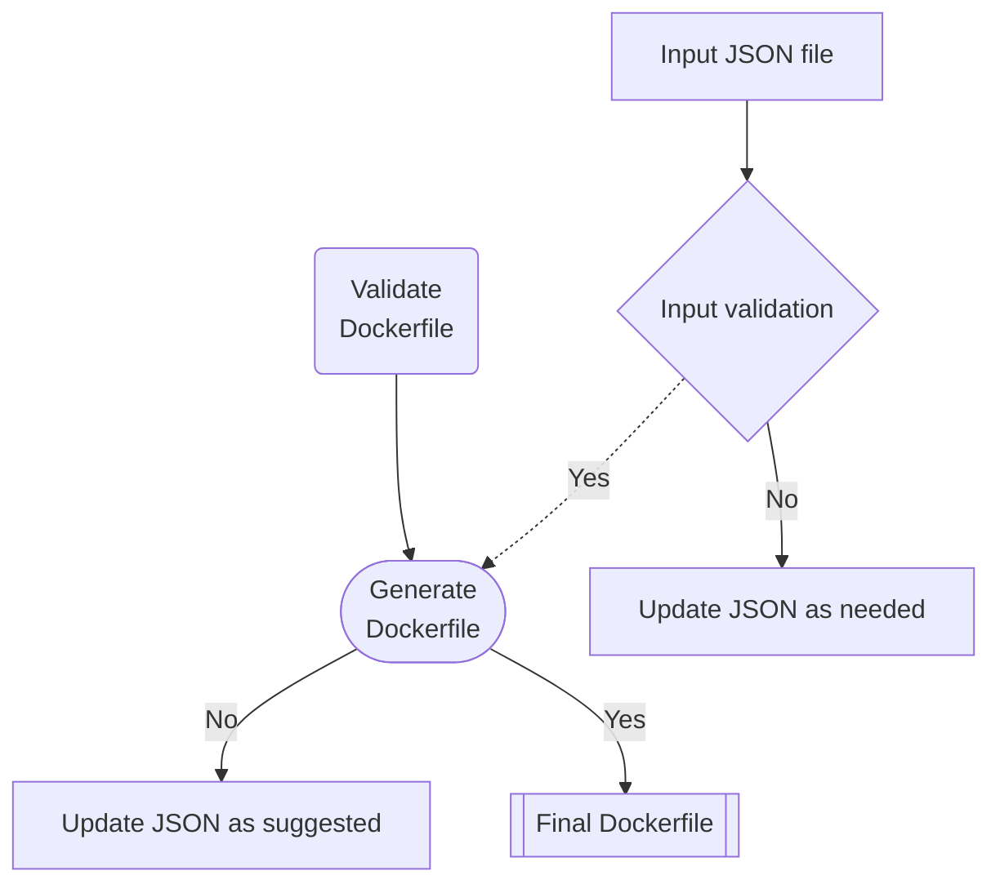

[](https://www.bestpractices.dev/projects/7843)

# genval
Verify, Generate and Validate dockerfile, K8s Manifests, Helm, Timoni, Kustomize, K8s Operators, Tekton, GitOps, K8s Infa YAML files, etc. programmatically.


## Simplifying Dockerfile Validation and Generation

**GenVal** is a powerful utility written in Golang that simplifies the process of Dockerfile validation and generation. Whether you're new to Docker or a seasoned pro, GenVal can help you create Dockerfiles that adhere to best practices for security and optimization.

## Why GenVal?

Managing Dockerfiles can be complex. It's crucial to ensure they follow best practices, but this can be time-consuming and error-prone. GenVal takes care of the heavy lifting by automating these processes, making Dockerfile management more efficient.

## Features

- **Input Validation**: GenVal begins by validating your input, which can be provided in JSON format. This initial step ensures that your input data is correctly structured.

- **Dockerfile Generation**: Once your input passes validation, GenVal generates a Dockerfile for you based on the provided data. This Dockerfile will be tailored to your specifications.

- **Best Practice Validation**: After generating the Dockerfile, GenVal doesn't stop there. It checks your Dockerfile against a set of predefined best practices for security and optimization. 

- **Informative Feedback**: If GenVal detects any issues or discrepancies during the best practice validation, it provides informative feedback. This feedback helps you understand what needs improvement in your Dockerfile.


> Note: Currently, `genval` requires a pre-defined structure for the input json to be provided for generating and validating the generated Dockerfile. The sample input `json` files are stored in `/templates/dockerFile-samples` directory of the project.

## Getting Started

Using GenVal is straight forward:

`genval` is available as a binary executable for all major platforms, the binaries can be downloaded from the official [release page](https://github.com/intelops/genval/releases)

## Verifying the binary signatures 

The GenVal release process signs the binaries using Cosign's keyless signing mode. To verify a perticular binary, retrive the release checksum together with its signature and public certificate for the desired `TAG`.

> Note: Cosign 2.0 requires the `--certificate-identity` and `--certificate-oidc-issuer` options.
For more information please refer to the [Sigstore blog](https://blog.sigstore.dev/cosign-2-0-released/). 

```shell
wget https://github.com/intelops/genval/releases/download/v0.0.1/checksums.txt
wget https://github.com/intelops/genval/releases/download/v0.0.1/checksums.txt.pem
wget https://github.com/intelops/genval/releases/download/v0.0.1/checksums.txt.sig
# Remember to update the tag (v0.0.1) in the above url for your desired release
```
Verify the downloaded blob i.e the `checksums.txt` using cosign tool

```shell
cosign verify-blob \
    --certificate-identity "https://github.com/intelops/genval/.github/workflows/release.yaml@refs/tags/v0.0.1" \
    --certificate-oidc-issuer "https://token.actions.githubusercontent.com" \
    --cert ./checksums.txt.pem \
    --signature ./checksums.txt.sig \
    ./checksums.txt
```

If the verification is successful, we would ge an output `Verified OK`.


**Installation**: To install GenVal on your system. You can downlod the executable binary from the releases page, make it an executible and you are ready to go.

```shell
curl https://github.com/intelops/genval/releases/download/v0.0.1/genval_0.0.1_<os/arch>.tar.gz
tar -xvf genval_0.0.2_<os/arch>.tar.gz
chmod +x genval
# move the executable to PATH
mv ./genval /usr/local/bin
```
For quick start, there are some pre-built templates to build Dockerfile for popular languages in `/templates/dockerFile-sample` directory. 

## Build from source

To build `genval` from source, you can follow the instructions as below:

> Note: If you are building from source, please ensure you are building the application from the `main` branch to avoid any unstable behaviour of the tool.  


```shell
git clone https://github.com/intelops/genval.git
```
Navigate to the project directory
`cd genval`

Now you can build `genval` using the following command:

```shell
CGO_ENABLED=0 go build -o genval
```
The generated binary will be available in the current working directory, i.e `genval`. You can optionally move the genval executable to your `PATH` or use the relative path `./genval` to use the tool from `pwd`.

Now, you are ready to generate your Dockerfile with following command:


- **Validation and Generation**: Run GenVal, providing the path to your input JSON or YAML file and the desired path for the generated Dockerfile. GenVal will take care of the rest.

`genval ./templates/dockerfile-samples/go-input.json ./Dockerfile-Golang`

- **Review Feedback**: GenVal will display feedback based on the best practice validation. If any issues are found, you can use this feedback to refine your Dockerfile.

Here's a simple command to use GenVal:

```shell
genval <path/to/input-json> <path/to/Dockerfile>
```

Replace `<path/to/input-json>` with the path to your input JSON file and `<path/to/Dockerfile>` with the desired path for the generated Dockerfile.

## Application Flow Diagram: 



GenVal simplifies Dockerfile management by automating validation and generation while ensuring that your Dockerfiles adhere to best practices. It's a valuable tool for both Docker novices and experts.

